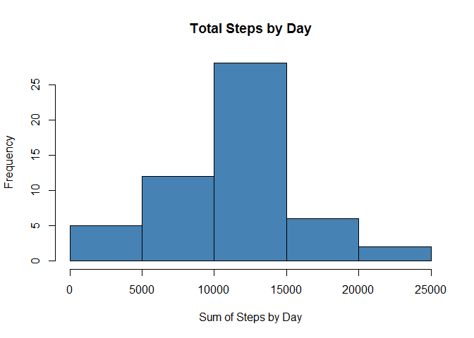
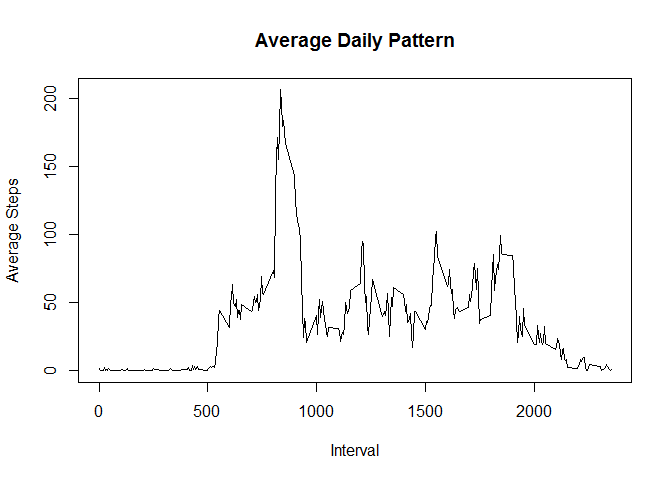
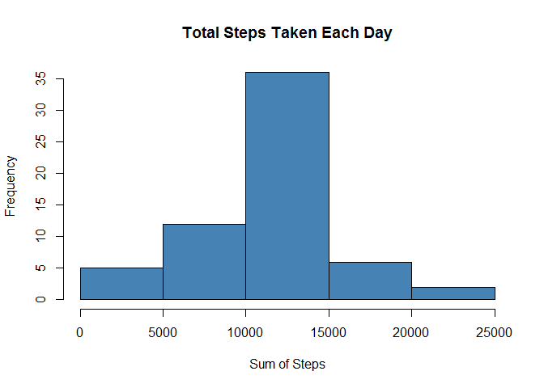
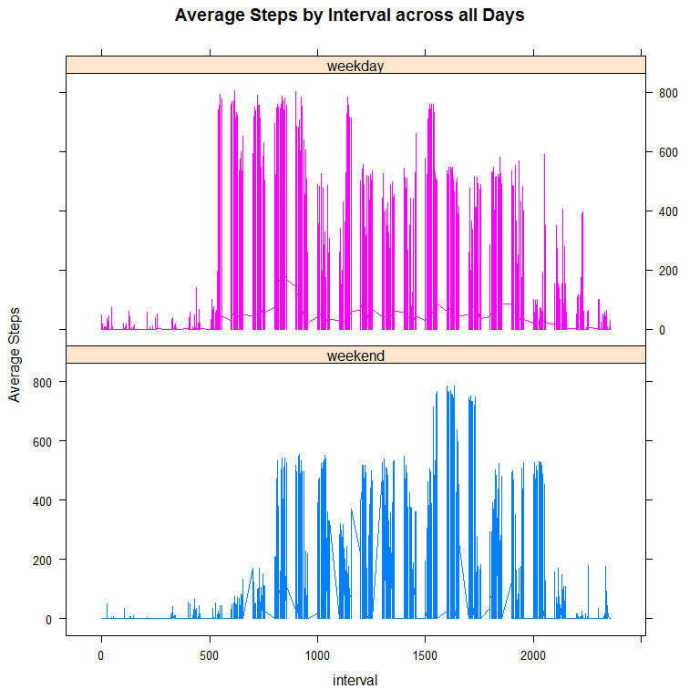

# Reproducible Research: Peer Assessment 1


## Loading and preprocessing the data, get summary to determine column formats

```r
library(plyr)
library(dplyr)
```

```
## 
## Attaching package: 'dplyr'
```

```
## The following objects are masked from 'package:plyr':
## 
##     arrange, count, desc, failwith, id, mutate, rename, summarise,
##     summarize
```

```
## The following objects are masked from 'package:stats':
## 
##     filter, lag
```

```
## The following objects are masked from 'package:base':
## 
##     intersect, setdiff, setequal, union
```

```r
library(tidyr)
unzip("./activity.zip")
act<-read.csv("./activity.csv",header=TRUE, sep=",")
```


## What is mean total number of steps taken per day?

```r
##sum of steps per day
act$steps<-as.numeric(as.integer(act$steps))
act$date<-as.character(act$date)
act$data<-as.Date(act$date)
sumstep<-ddply(act, "date", summarise, sum.steps = sum(steps))
```


```r
##Frequency of occurrence of total number of steps

hist(sumstep$sum.steps,col="steelblue",main="Total Steps by Day",xlab="Sum of Steps by Day")
```

<!-- -->


```r
##Find the mean and median total steps per day
mn<-mean(sumstep$sum.steps,na.rm=TRUE)
print(mn)
```

```
## [1] 10766.19
```

```r
md<-median(sumstep$sum.steps,na.rm=TRUE)
print(md)
```

```
## [1] 10765
```
## What is the average daily activity pattern?

```r
actdayint<-ddply(act,"interval",summarise,mean.steps=mean(steps,na.rm=TRUE))

plot(actdayint$interval,actdayint$mean.steps,type="l",xlab="Interval",ylab="Average Steps",main="Average Daily Pattern")
```

<!-- -->


```r
## find interval at which most average steps are taken. g=location in dataframe,result echoed= interval label
g<-which.max(actdayint$mean.steps)
actdayint$interval[g]
```

```
## [1] 835
```

## Imputing missing values

```r
##total number of missing values
cnt<-is.na(act$steps)
stepna<-subset(act,cnt==TRUE)
nrow(stepna)
```

```
## [1] 2304
```


```r
##filling in missing values using mean by interval and replot

library(Hmisc)
```

```
## Warning: package 'Hmisc' was built under R version 3.3.3
```

```
## Loading required package: lattice
```

```
## Loading required package: survival
```

```
## Loading required package: Formula
```

```
## Loading required package: ggplot2
```

```
## 
## Attaching package: 'Hmisc'
```

```
## The following objects are masked from 'package:dplyr':
## 
##     combine, src, summarize
```

```
## The following objects are masked from 'package:plyr':
## 
##     is.discrete, summarize
```

```
## The following objects are masked from 'package:base':
## 
##     format.pval, round.POSIXt, trunc.POSIXt, units
```

```r
act2<-act
act2 <- ddply(act, "interval", mutate, imputed.steps = (round(impute(steps, mean))))
act2$imputed.steps<-as.numeric(act2$imputed.steps)
act2sum<-ddply(act2, "date", summarise, sum.steps = sum(imputed.steps))
```

```r
hist(act2sum$sum.steps,col="steelblue",main="Total Steps Taken Each Day",xlab="Sum of Steps")
```

<!-- -->

```r
##recalculate mean and median total steps per day
mn2<-mean(act2sum$sum.steps)
print(mn2)
```

```
## [1] 10765.64
```

```r
med2<-median(act2sum$sum)
print(med2)
```

```
## [1] 10762
```
## Are there differences in activity patterns between weekdays and weekends?

```r
##classify data as weekday or weekend by date
wkact<-act2
wkact$date<-as.Date(wkact$date)
weekdays1 <- c("Monday", "Tuesday", "Wednesday", "Thursday", "Friday")
wkact$wktype <- factor((weekdays(wkact$date) %in% weekdays1), 
         levels=c(FALSE, TRUE), labels=c("weekend", "weekday")) 
```

```r
##plot based on week type
library(lattice)

xyplot(imputed.steps ~ interval | wktype, groups = wktype, data = wkact, type = "l",layout=c(1,2),ylab = "Average Steps",main="Average Steps by Interval across all Days")
```

<!-- -->
